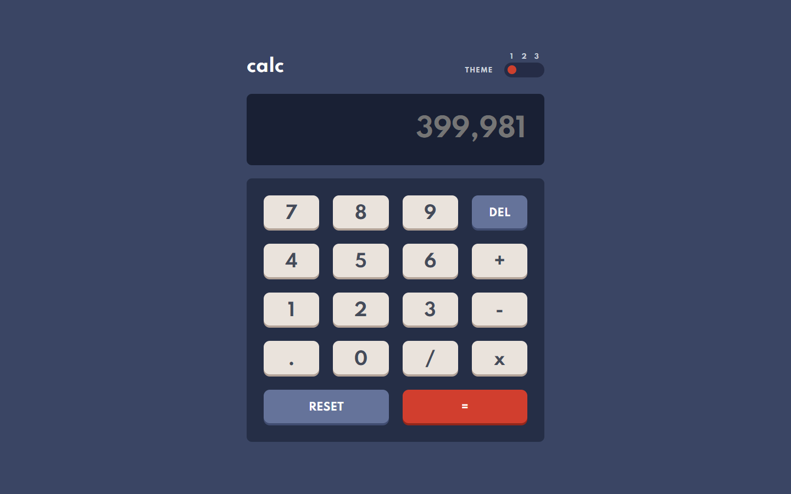
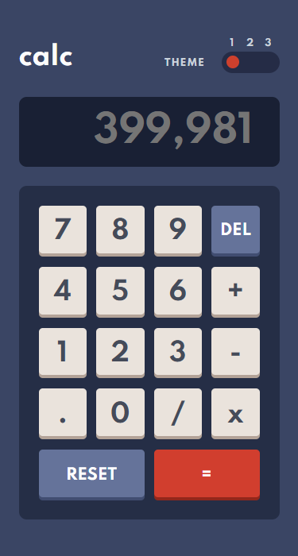

# Frontend Mentor - Calculator app solution

This is a solution to the [Calculator app challenge on Frontend Mentor](https://www.frontendmentor.io/challenges/calculator-app-9lteq5N29). Frontend Mentor challenges help you improve your coding skills by building realistic projects. 

## Table of contents

- [Frontend Mentor - Calculator app solution](#frontend-mentor---calculator-app-solution)
  - [Table of contents](#table-of-contents)
  - [Overview](#overview)
    - [The challenge](#the-challenge)
    - [Screenshot](#screenshot)
    - [Links](#links)
  - [My process](#my-process)
    - [Built with](#built-with)
    - [What I learned](#what-i-learned)
    - [Useful resources](#useful-resources)
  - [Author](#author)
## Overview

### The challenge

Users should be able to:

- [x] See the size of the elements adjust based on their device's screen size
- [x] Perform mathmatical operations like addition, subtraction, multiplication, and division
- [x] Adjust the color theme based on their preference
- [x] **Bonus**: Have their initial theme preference checked using `prefers-color-scheme` and have any additional changes saved in the browser

### Screenshot

### Links

- Live Site URL: [Preview](https://k0smic.github.io/calculator-app/)

## My process

### Built with

- Semantic HTML5 markup
- CSS custom properties
- Flexbox
- CSS Grid
- Mobile-first workflow
- [Sass](https://sass-lang.com/)

### What I learned

This project was relatively simple, it took longer to measure, as they have to be as faithful to the design as possible.
Probably the code is not the best of optimization but I accept suggestions.

In this project, I improved my skills with grids, discovered new approaches with JavaScript, and wrote more readable code.

### Useful resources

- [Font-size Clamp Generator](https://clamp.font-size.app/) - Perfect for resizing any size, from fonts to images.
- [Nekocalc PX to REM](https://nekocalc.com/px-to-rem-converter)

## Author

- Github - [K0smic](https://github.com/K0smic)
- Frontend Mentor - [@K0smic](https://www.frontendmentor.io/profile/K0smic)
